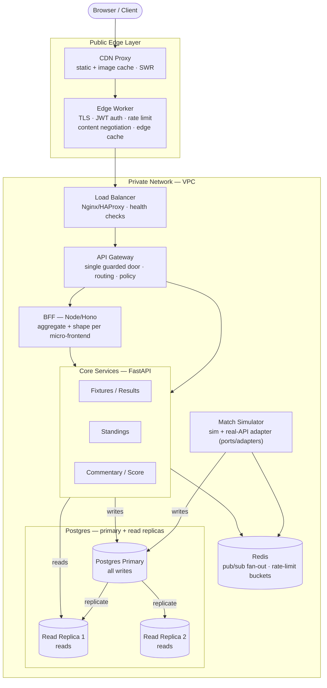
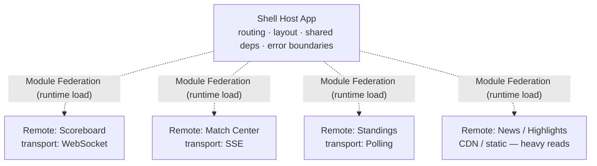
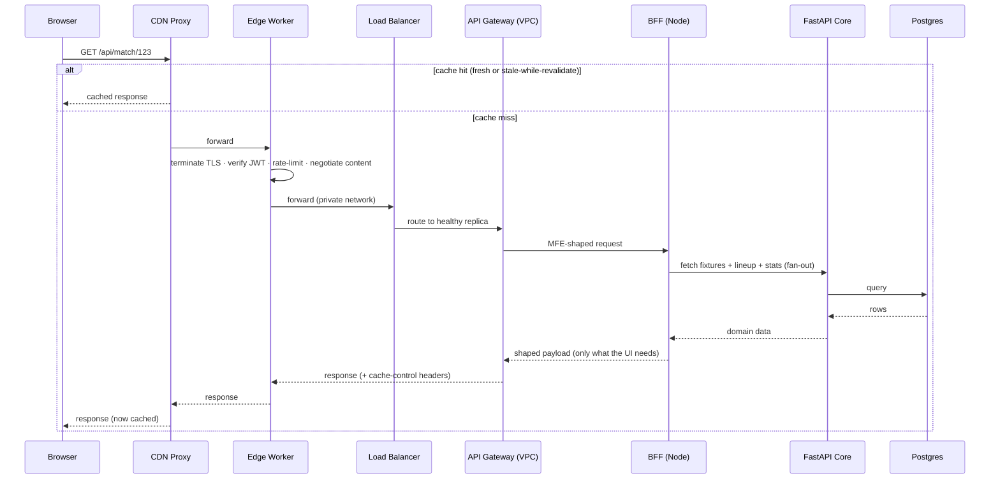
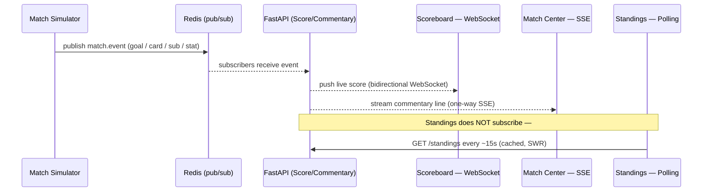
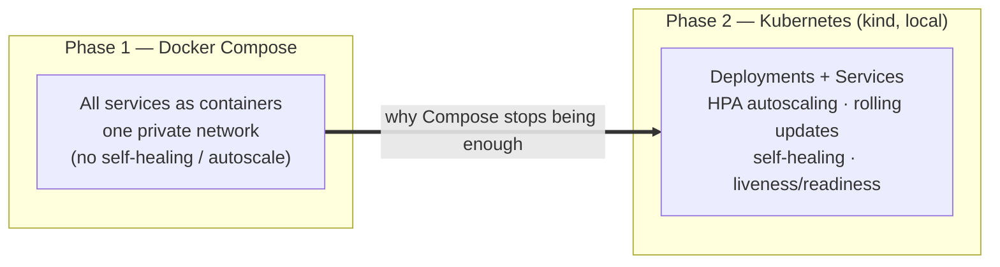

<!-- Author: Bishakh -->

# World Cup 2026 Live Hub — Architecture

> The teaching vehicle for the **30-Day Frontend Architecture Challenge**.
> One product, built up day by day, that forces every topic to appear for a *real* reason —
> and for each topic we show **the naive way → why it breaks → what we use → the trade-off we accepted.**

---

## 1. System Topology (containers on a private network)

Every box below is a real container. The **public edge layer** is the only thing exposed;
everything else lives on a private Docker network (our "VPC").



**Two deliberate teaching points in this topology:**
- **API Gateway ≠ Load Balancer.** The LB spreads traffic across replicas (and removes unhealthy ones); the gateway is the single policy/routing door into the VPC. They're separate boxes on purpose.
- **Postgres is primary + read replicas.** All writes go to the primary; reads are served from replicas; the primary streams changes to the replicas (replication). This is how the read-heavy hub scales reads without overloading one database.

---

## 2. Frontend — Micro-frontend composition (Module Federation)

A **shell host** owns routing, layout and shared dependencies. Each panel is an independent
**remote**, built and deployed on its own cadence by its own "team", and each deliberately uses a
**different real-time transport** so one product showcases all three.



**Vertical slicing:** each slice owns its UI **and** its BFF route **and** its data domain end-to-end —
not split horizontally by layer.

---

## 3. Request lifecycle (cache → edge → VPC → origin)



---

## 4. Real-time fan-out (one simulator, three transports)



**The difference, on camera:** Polling = simple, wasteful, laggy. SSE = one-way, auto-reconnect, HTTP-native.
WebSocket = bidirectional, lowest latency, more ops cost. We prove *per-use-case* selection instead of one transport everywhere.

---

## 5. Deployment evolution (Compose → Kubernetes)

We start where it's simplest and graduate only when the simpler tool visibly stops being enough.



---

## 6. Repository structure (Turborepo monorepo)

```
worldcup-hub/                      # Turborepo root
├─ apps/
│  ├─ shell/                       # MFE host (React + Vite + TS)
│  ├─ mfe-scoreboard/              # remote — WebSocket
│  ├─ mfe-match-center/            # remote — SSE
│  ├─ mfe-standings/               # remote — polling
│  └─ mfe-news/                    # remote — CDN / static
├─ services/
│  ├─ bff/                         # Node/Hono BFF (per-frontend shaping)
│  ├─ core-api/                    # FastAPI + Postgres (domain services)
│  ├─ simulator/                   # FastAPI match simulator (+ real-API adapter)
│  ├─ edge/                        # edge worker (wrangler/workerd or Hono)
│  ├─ gateway/                     # API gateway config
│  ├─ lb/                          # Nginx / HAProxy config
│  └─ cdn/                         # caching proxy config
├─ packages/
│  ├─ ui/                          # shared design system
│  ├─ types/                       # shared TS types (BFF <-> MFEs)
│  └─ config/                      # shared tsconfig / eslint
├─ infra/
│  ├─ docker/                      # Dockerfiles + docker-compose.yml
│  └─ k8s/                         # kind cluster + manifests + HPA
├─ docs/                           # per-day tutorial write-ups
└─ turbo.json
```

---

## 7. Topic → component map

| # | Topic | Where it lives in this build |
|---|-------|------------------------------|
| 1 | Micro-frontend | Shell host loads remotes via Module Federation |
| 2 | Monorepo + vertical slicing | Turborepo; each slice owns UI + BFF route + data domain |
| 3 | Edge Functions (cache/HTTPS/auth/content-negotiation/rate-limit) | Edge worker tier — one feature per sub-topic |
| 4 | API Gateway in VPC | Gateway container on private network, no public ports |
| 5 | Load Balancing | Nginx/HAProxy across core-service replicas + health checks |
| 6 | Container System | Docker multi-stage builds, one Dockerfile per service |
| 7 | Orchestration | kind/k8s — Deployments, Services, HPA, rolling updates |
| 8 | BFF | Node/Hono tier shaping data per micro-frontend |
| 9 | CDN | Caching proxy + cache headers + SWR + asset versioning |
| 10 | Core Web Vitals (LCP/INP/CLS) | Measured with Lighthouse + `web-vitals`, fixed live |
| 11 | Real-time (Polling/WS/SSE) | Standings=poll, Match Center=SSE, Scoreboard=WS, via Redis fan-out |
| 12 | Database replication & read scaling | Postgres primary (writes) + read replicas (reads); streaming replication; read/write split in core-api |

See [`the-difference.md`](./the-difference.md) for the alternatives-and-why-not table that anchors each episode.
