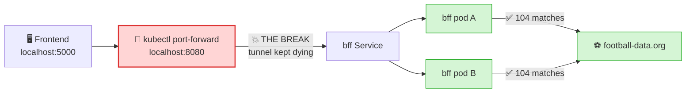
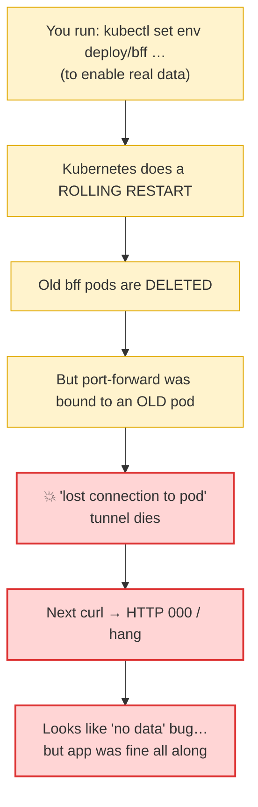
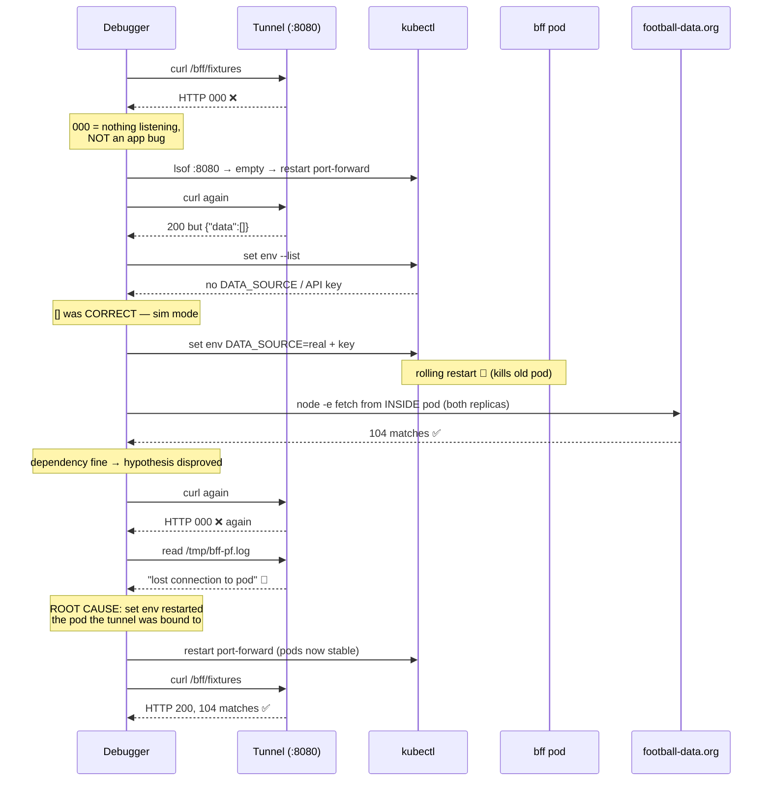
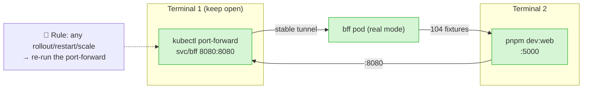

<!-- Author: Bishakh -->

# Debugging the Stack — a worked example + a reusable playbook

This doc has two parts:

1. **The playbook** — a repeatable method for debugging "the frontend shows no data" on the
   Kubernetes setup (works for Compose too).
2. **A real worked example** — the actual session where `/bff/fixtures` returned `[]`, narrated
   step by step, so you can see the method in action.

The golden rule running through both: **isolate layer by layer, from the outside in. Don't guess
— prove where the break is before changing anything.**

---

## Part 1 — The playbook

The request path on the k8s setup is:

```
browser (FE :5000)  →  kubectl port-forward (:8080)  →  bff Service  →  bff pod
                                                                          ↓
                                              football-data.org  /  core-api  /  redis
```

A symptom like "no data on the page" can come from **any** hop. Walk them in order — each step
either clears a layer or pinpoints the break.

### Step 0 — State the symptom precisely
"No data" is vague. Get the exact HTTP status + body:
```bash
curl -s -m 15 -w '\n[HTTP %{http_code}, %{time_total}s]\n' 'http://localhost:8080/bff/fixtures' | head -c 300
```
Read the status code like a map:
- **`HTTP 000`** → connection never made. The tunnel/server isn't there. (Not an app bug.)
- **timeout / hang** → something downstream is blocking (egress, a dead pod).
- **`HTTP 200` but `{"data":[]}`** → the server works; the *data source* is the problem.
- **`HTTP 4xx/5xx`** → the app itself errored; go read its logs.

### Step 1 — Is the tunnel even up?
`HTTP 000` almost always means the port-forward died (see the worked example for *why* it dies).
```bash
lsof -i :8080                 # nothing listed = no tunnel
tail -5 /tmp/bff-pf.log       # read the port-forward's own error
# restart it:
kubectl -n worldcup port-forward svc/bff 8080:8080
```

### Step 2 — Are the pods actually running?
```bash
kubectl -n worldcup get pods            # every pod READY 1/1, STATUS Running?
kubectl -n worldcup get pods -l app=bff # check the specific service
```
Look at **AGE** too — a pod that just restarted (low age) tells you a rollout happened.

### Step 3 — What is the app itself saying? (logs)
```bash
kubectl -n worldcup logs -l app=bff --tail=40 --since=3m
kubectl -n worldcup logs -l app=bff --since=3m | grep -iE 'error|failed|429|HTTP [45]'
```
Confirm the mode it booted in (e.g. `data source: real (football-data.org)` vs `sim`).
**No error in the logs is itself a clue** — it means the app isn't failing; look elsewhere
(tunnel, config, or an upstream that returns success-but-empty).

### Step 4 — Is the app configured the way you think?
```bash
kubectl -n worldcup set env deploy/bff --list   # see the real env the pod is running with
```
This is where "empty data" bugs often live: a missing `DATA_SOURCE=real` / `FOOTBALL_API_KEY`
means the app is *correctly* serving nothing.

### Step 5 — Test the dependency in isolation (from where it runs)
Don't assume the pod can reach the internet — prove it, **from inside the pod**, and **on every
replica** (a Service load-balances across pods; one bad replica = intermittent failures):
```bash
for POD in $(kubectl -n worldcup get pods -l app=bff -o jsonpath='{.items[*].metadata.name}'); do
  echo "=== $POD ==="
  kubectl -n worldcup exec "$POD" -- node -e '
    fetch("https://api.football-data.org/v4/competitions/WC/matches",
          {headers:{"X-Auth-Token":process.env.FOOTBALL_API_KEY}})
     .then(r=>r.json()).then(j=>console.log("matches:",(j.matches||[]).length,"msg:",j.message||"none"))
     .catch(e=>console.log("ERR:",e.message))'
done
```
(Use `node -e` because slim images often have no `curl`/`wget`.)

### Step 6 — Read the code path only once the layers above are clean
If the tunnel is up, pods run, config is right, and the dependency answers — *now* read the
handler to see how it maps the data (e.g. `services/bff/src/footballData.ts` →
`fixturesView()`). Code-reading is the **last** step, not the first.

### Quick triage table

| You see | Most likely | Go to |
|---|---|---|
| `HTTP 000`, instant | tunnel/server down | Step 1 |
| hang then timeout | dead pod / blocked egress | Steps 1, 5 |
| `200` + `{"data":[]}` | wrong/missing config, or empty upstream | Steps 4, 5 |
| `4xx/5xx` | app error | Step 3 |
| works sometimes | one bad replica behind the Service | Step 5 (loop all pods) |

---

## Part 2 — The worked example (what actually happened)

**Symptom:** the FE showed nothing; `curl http://localhost:8080/bff/fixtures` → `{"data":[]}`.

1. **Looked at the path, not the code.** `HTTP 000` on the first curl → not an app bug, the
   tunnel wasn't up. `lsof -i :8080` confirmed nothing was listening. → started the port-forward.

2. **Checked pods + logs.** All 10 pods `Running`. BFF logs were clean but said the data source
   was *not* configured for real data — only `REDIS_URL/CORE_API_URL/SIMULATOR_URL/PORT` were set.
   `set env --list` confirmed **no `DATA_SOURCE` / `FOOTBALL_API_KEY`**. So `[]` was *correct*:
   `/bff/fixtures` is a real-data feature, and the BFF was in `sim` mode.

3. **Fixed the config.** `kubectl set env deploy/bff DATA_SOURCE=real FOOTBALL_API_KEY=… WC`.
   Logs now showed `data source: real (football-data.org)`. **But fixtures were still empty, and
   now requests *hung*.**

4. **Suspected egress / rate limiting — and tested the dependency directly.** Ran `fetch` from
   inside the pod with `node -e`. It returned **104 matches, status 200, no rate-limit message**,
   on **both** replicas. So egress was fine and the key was valid. The dependency was *not* the
   problem — which ruled out my own hypothesis. (Disproving your guess is progress.)

5. **Re-tested the endpoint → `HTTP 000` again.** The tunnel had died *again*. Read its log:
   ```
   error forwarding port 8080 to pod … failed to find sandbox … not found
   error: lost connection to pod
   ```

6. **Root cause.** Step 3's `set env` triggered a **rolling restart**. The port-forward was bound
   to an *old* pod; when Kubernetes deleted it, the tunnel died. Every curl afterwards hit a dead
   tunnel → `000` / hangs / stale empties. **The app was healthy the entire time** — the flakiness
   was purely the tunnel breaking on pod replacement.

7. **Fix + verify.** Pods were now stable, so a fresh `port-forward` stuck. Re-ran the curl →
   **`HTTP 200`, 104 matches** of real World Cup data (`MEX vs RSA`, …). Done.

### Lessons it teaches

- **`HTTP 000` ≠ app bug.** It's "nothing is listening" — check the tunnel/server first.
- **A port-forward dies when its pod is replaced.** Any `set env`, `rollout restart`, scale, or
  crash that recreates the pod drops the tunnel. **Re-run the port-forward after any rollout.**
- **`200` + `[]` is a config story, not a crash.** The server is fine; ask "what data source is
  it pointed at?"
- **Test dependencies from where they run, on every replica.** `node -e` inside the pod proved
  egress and isolated the problem away from the network.
- **Disproving your own hypothesis is forward progress** — it stopped me wasting time on
  "rate limiting" and sent me back to the tunnel.
- **Read code last.** The fix was config + ops, not a line of TypeScript.

---

## Part 3 — The same story as diagrams

### Where it broke (the request path)



### Why the tunnel kept dying (root cause)



### The debugging journey (sequence)



### The fixed, healthy setup


