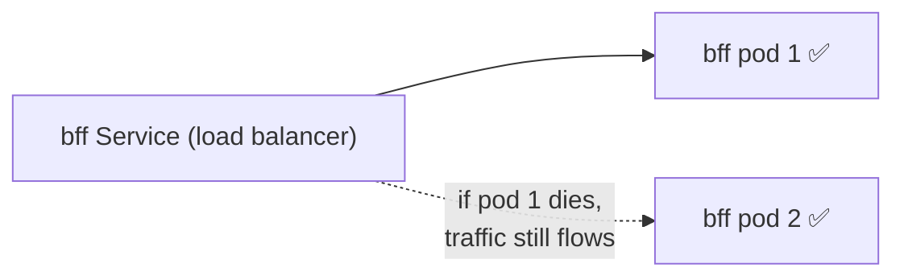

<!-- Author: Bishakh -->

# Kubernetes — Learning Notes & Issues Log

A living doc. **Top half** = the concepts, explained from zero. **Bottom half** = an
**Issues Log** — every Kubernetes problem we hit, its root cause, and the fix. Add to the log as
new issues come up (newest at the top of the log).

---

## 1. What Kubernetes is (and `kind`)

**Kubernetes (k8s)** is the system that runs containers in production: it spreads them across
machines, restarts crashed ones, scales them under load, and rolls out new versions without
downtime.

**`kind`** = **K**ubernetes **IN** **D**ocker. It creates a *real* Kubernetes cluster that runs
entirely inside Docker containers **on your laptop** — a flight simulator for k8s. It needs the
Docker daemon running (no Docker → no cluster).

> Everything here (`docker compose`, `compose.full.yml`, `kind`) needs **Docker Desktop running
> first, every session.**

---

## 2. The vocabulary, smallest to biggest

> **Image** = recipe (a file). **Container** = the running meal. **Pod** = the plate (k8s' wrapper).
> **Node** = the table (a machine). **Cluster** = the whole restaurant.

| Term | What it is | Running? | This project |
|---|---|---|---|
| **Image** | Frozen blueprint: code + runtime + libs | ❌ a file | `worldcup-core-api` |
| **Container** | An image brought to life | ✅ | what `docker compose up` starts |
| **Pod** | k8s' wrapper around a container (usually 1:1) | ✅ | the "2→6 pods" the HPA scales |
| **Node** | A machine that hosts pods | ✅ | the `kind` Docker container |
| **Cluster** | All nodes + the k8s "brain" | ✅ | what `kind create cluster` makes |
| **Deployment** | "Keep N copies of this pod alive" | — | `bff`, `core-api`, `edge` |
| **Service** | Stable address + load balancer over a Deployment's pods | — | `svc/bff`, `svc/core-api` |
| **Replica** | One identical copy of a pod | ✅ | `bff` has 2 |
| **HPA** | Auto-scales replicas on load | — | core-api 2→6 at 70% CPU |

**Key split:** *Image + Container* = plain **Docker** (you already use these). *Pod + Node +
Cluster + Deployment + Service* = **Kubernetes**, layered on top. Same containers — just wrapped
and managed.

---

## 3. Replicas — why 2 pods?

A **Deployment** has a `replicas: N` line meaning "always keep N identical copies alive". `bff`
has `replicas: 2`, so Kubernetes runs two interchangeable clones (no primary/special one). Why
more than 1:

1. **High availability** — one pod crashes, the other keeps serving while k8s replaces it.
2. **Load sharing** — the Service round-robins requests across both → ~2× capacity.
3. **Zero-downtime updates** — rolling updates replace pods one at a time, always leaving one up.

**Stateless vs stateful:** stateless services (`bff`, `core-api`, `edge`) are safe to clone, so
`replicas: 2`. Stateful ones hold data and can't be naively cloned — `redis`/`simulator` run 1,
and Postgres uses a **primary + read replica** (two *specialised* pods) instead of identical
clones.



Change it live: `kubectl -n worldcup scale deploy/bff --replicas=3`.

---

## 4. This project's cluster (`infra/k8s/`)

16 resources in a `worldcup` namespace. The **frontend is NOT in k8s** — only the backend is.

| Service | Replicas | Notes |
|---|---|---|
| `bff`, `edge` | 2 | stateless; `edge` exposed via **NodePort 30888** |
| `core-api` | 2 → 6 | stateless + **HPA** (CPU 70%) + liveness/readiness probes |
| `redis`, `simulator` | 1 | single instance |
| `postgres-primary` / `postgres-replica` | 1 each | streaming replication (writes→primary, reads→replica) |

**Run it:**
```bash
brew install kind && kind create cluster
# build + load the 4 images into the cluster:
docker build -t worldcup-core-api ../../services/core-api
docker build -t worldcup-simulator ../../services/simulator
docker build -f ../../services/bff/Dockerfile  -t worldcup-bff  ../..
docker build -f ../../services/edge/Dockerfile -t worldcup-edge ../..
kind load docker-image worldcup-core-api worldcup-simulator worldcup-bff worldcup-edge
kubectl apply -f infra/k8s/
kubectl -n worldcup get pods,hpa
```

**Reach the in-cluster backend from your Mac** (the FE runs locally and calls the BFF):
```bash
kubectl -n worldcup port-forward svc/bff 8080:8080   # keep this terminal open
```

---

## 5. Everyday commands cheat-sheet

```bash
kubectl -n worldcup get pods                 # status of every pod (READY, AGE, RESTARTS)
kubectl -n worldcup get deploy               # replica counts
kubectl -n worldcup logs -l app=bff --tail=40 --since=3m   # logs across all pods of a label
kubectl -n worldcup set env deploy/bff --list              # the real env a pod runs with
kubectl -n worldcup set env deploy/bff KEY=value           # set env (triggers a rolling restart!)
kubectl -n worldcup scale deploy/bff --replicas=3          # change replica count
kubectl -n worldcup exec <pod> -- node -e '…'              # run something INSIDE a pod
kubectl -n worldcup port-forward svc/bff 8080:8080         # tunnel a Service to localhost
kubectl -n worldcup rollout status deploy/bff              # wait for a rollout to finish
```

---

# Issues Log

> Newest first. Format: **Symptom → Root cause → Fix → Lesson.**

## #1 — Frontend showed no data; `/bff/fixtures` returned `[]`, then `HTTP 000`

**Symptom:** `curl localhost:8080/bff/fixtures` → `{"data":[]}`, and later `HTTP 000` / hangs.

**Investigation:**
- `HTTP 000` = nothing listening → the **port-forward tunnel was down** (not an app bug).
- Pods all `Running`, logs clean, but `set env --list` showed **no `DATA_SOURCE`/`FOOTBALL_API_KEY`**
  → the BFF was in `sim` mode, so `[]` was *correct*.
- Set real-data env → logs confirmed `real (football-data.org)`, but fixtures still empty + hanging.
- Tested egress **from inside both pods** with `node -e fetch(...)` → **104 matches, 200, no
  rate-limit** → dependency was fine; hypothesis disproved.
- Re-curl → `HTTP 000` again. The port-forward log showed:
  `error forwarding port 8080 to pod … failed to find sandbox … not found / lost connection to pod`.

**Root cause:** `kubectl set env` triggered a **rolling restart**. The port-forward was bound to an
*old* pod; when k8s deleted it, the tunnel died. The app was healthy the entire time.

**Fix:** pods were stable afterwards, so a fresh `kubectl port-forward svc/bff 8080:8080` stuck →
`HTTP 200`, 104 real fixtures.

**Lessons:**
- `HTTP 000` ≠ app bug — it's "nothing is listening"; check the tunnel/server first.
- **A port-forward dies when its pod is replaced.** Any `set env`, `rollout restart`, scale, or
  crash that recreates a pod drops the tunnel → **re-run the port-forward after any rollout.**
- `200` + `[]` is a **config** story (which data source?), not a crash.
- Test dependencies from **inside** the pod, on **every replica** (a Service load-balances).
- Read application code **last**, after tunnel → pods → logs → config → dependency are all clean.

*(Full narrative + diagrams: see `docs/debugging-the-stack.md`.)*

## #2 — `kind create cluster` failed: "Cannot connect to the Docker daemon"

**Symptom:** `kind create cluster` → `failed to get docker info … docker.sock: no such file or directory`.

**Root cause:** Docker Desktop wasn't running. `kind` builds the cluster *as a Docker container*,
so it needs a live Docker daemon. The Docker **CLI** being installed isn't enough — the **daemon**
must be up.

**Fix:** start Docker Desktop (`open -a Docker`), wait until ready
(`docker info --format '{{.ServerVersion}}'` prints a version), then re-run `kind create cluster`.

**Lesson:** **Start Docker Desktop first, every session,** before any `docker`/`kind`/`compose`
command.

<!-- Add new issues above this line, newest first:
## #N — <short symptom>
**Symptom:** …
**Root cause:** …
**Fix:** …
**Lesson:** …
-->
