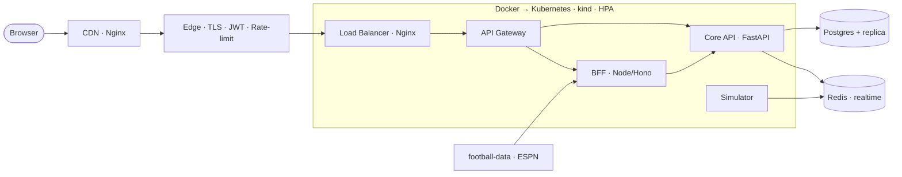

<!-- Author: Bishakh -->

# Video Script — "The Stack" (~75 sec)

**[Hook — 0:00]**
"One product. Every layer of modern web architecture. Here's the entire stack behind my World Cup
2026 Live Hub — in 60 seconds."

**[Frontend — 0:08]**
"The UI is **micro-frontends** — a React + Vite shell that loads four independent apps at runtime with
**Module Federation**, all in a **pnpm + Turborepo** monorepo. Real-time comes three ways on purpose:
**WebSocket** for scores, **SSE** for commentary, **polling** for standings."

**[BFF — 0:25]**
"In front of the services sits a **Backend-for-Frontend** in **Node + Hono** — it shapes exactly what
each panel needs."

**[Backend — 0:33]**
"The core is **FastAPI + Postgres** (with **SQLAlchemy** and a read replica), a match **simulator**
using ports-and-adapters, and **Redis** for real-time fan-out. Real data comes from
**football-data.org** and **ESPN** — lineups, formations, possession, the lot."

**[Edge & infra — 0:48]**
"Everything sits behind a public edge: **Nginx** does TLS, the **API gateway**, **load balancing**, and
**CDN** caching — plus **JWT auth** and **rate limiting** at the edge."

**[Containers — 0:58]**
"It's all **Docker**-ised, wired with **Docker Compose**, and orchestrated on **Kubernetes** with
**kind** locally — Deployments, Services, and an **HPA** that autoscales under load."

**[End goal — 1:08]**
"The end goal: a real, live World Cup hub that's fast under a goal-moment traffic spike — and a
complete, hands-on map of how modern systems are actually built."

**[Outro — 1:18]**
"Full breakdown, episode by episode. Let's build."

---

## Architecture diagram

---

## One-line stack (for the description box)

`React · Vite · Module Federation · Turborepo/pnpm · Hono BFF · FastAPI · SQLAlchemy · Postgres ·
Redis · WebSocket/SSE/Polling · Nginx (edge/gateway/LB/CDN) · JWT · Docker · Docker Compose ·
Kubernetes (kind) · HPA · football-data.org · ESPN`
